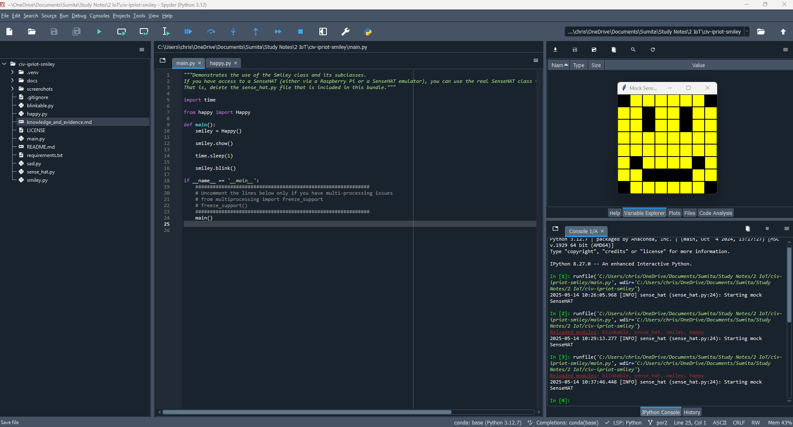
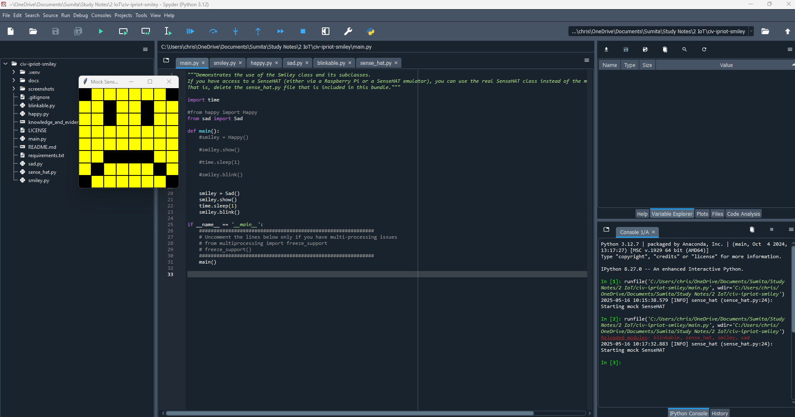
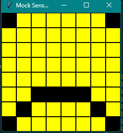
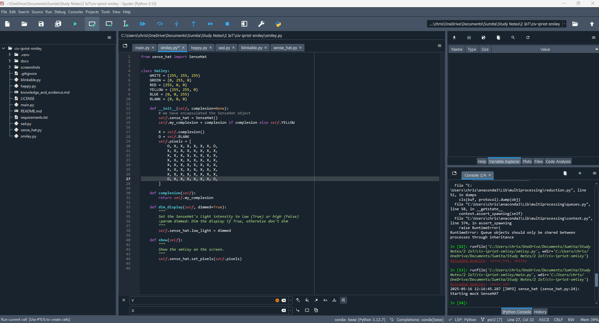
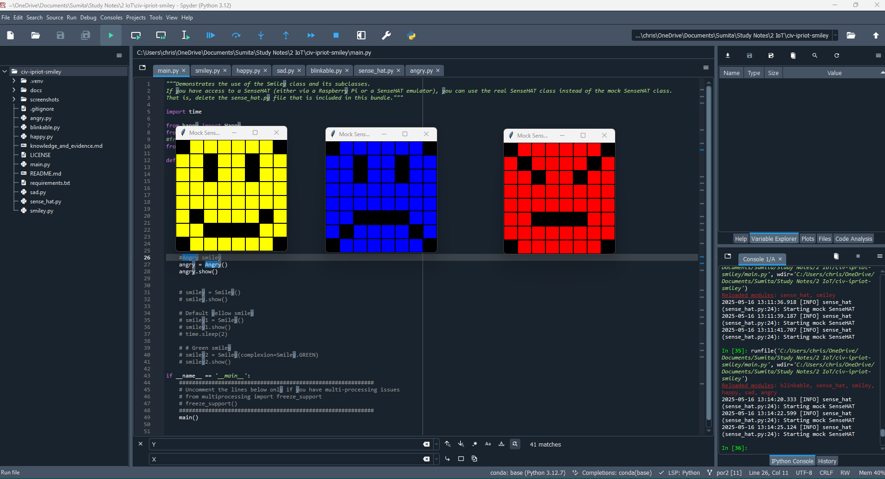

# Evidence and Knowledge

This document includes instructions and knowledge questions that must be completed to receive a *Competent* grade on this portfolio task.

## 1. Required evidence

### 1.1. Answer all questions in this document

- Each answer should be complete, well-articulated, and within the specified word count limits (if added) for each question.
- Please make sure **all** external sources are properly cited.
- You must **use your own words**. Please include your full chat transcripts if you use generative AI in any way.
- Generative AI hallucinates, is not an authoritative source

### 1.2. Make all the required modifications to the code

- Please follow the instructions in this document to make the changes needed to the code.

- When requested to upload evidence, upload all screenshots to `screenshots/` and embed them in this document. For example:

```markdown

```


> Note the `!`, and the use of a relative path.

- You must upload the code into your GitHub repository.
- While you can use a branch, your code should be in main when you submit.
- Upload a zip of this repository to Blackboard when you are ready to submit.
- You will be notified of your result via Blackboard
- However, if using GitHub classrooms, you may also receive additional feedback on GitHub directly

### 1.3. Optional: Use of Raspberry Pi and SenseHat

Raspberry Pi or SenseHat is **optional** for this activity. You can use the included `sense_hat.py` file to simulate the SenseHat on your computer.

If you use a Pi, please **delete** the `sense_hat.py` file.

### 1.4. Accessible version of the code

This project relies on visual patterns that appear on an LED matrix. If you have any accessibility requirements, you can use the `udl/accessible` branch to complete the project. This branch provides an accessible code version that uses text-based patterns instead of visual ones.

Please discuss this with your lecturer before using that branch.

## 2. Specific Tasks & Questions

Address the following tasks and questions based on the code provided in this repository.

### 2.1. Set up the project locally

1. Fork this repository (if not using GitHub Classrooms)
2. Clone your repository locally
3. Run the project locally by executing the `main.py` file
4. Evidence this by providing screenshots of the project directory structure and the output of the `main.py` file



If you are running on a Raspberry Pi, you can use the following command to run the project and then screenshot the result:

```bash
ls
python3 main.py
```

### 2.2. Fundamental code comprehension

 Answer each of the following questions **as they relate to that code** supplied by in this repository (ignore `sense_hat.py`):

1. Examine the code for the `smiley.py` file and provide  an example of a variable of each of the following types and their corresponding values (`_` should be replaced with the appropriate values):

   | Type                    | name       | value          |
   | ----------              | ---------- | -------------- |
   | built-in primitive type | dimmed     |  True          |
   | built-in composite type | self.pixels| A list of YELLOW and BLANK tuples ([0,0,0), (255,255,0), (255,255,0), ..., (0,0,0)] |
   | user-defined type       | self.sense_hat | An instance of SenseHat class (imported from sense_hat.py), encapsulated inside the Smiley class |

2. Fill in (`_`) the following table based on the code in `smiley.py`:

   | Object                   | Type                    |
   | ------------             | ----------------------- |
   | self.pixels              | List                    |
   | A member of self.pixels  | Tuple                   |
   | self                     | Smiley - because it is an object created froom the Smiley class|

3. Examine the code for `smiley.py`, `sad.py`, and `happy.py`. Give an example of each of the following control structures using an example from **each** of these files. Include the first line and the line range:

   | Control Flow | File       | First line  | Line range  |
   | ------------ | ---------- | ----------- | ----------- |
   |  sequence    | smiley.py  | self.sense_hat = SenseHat() | 13-26 |
   |  selection   | sad.py     | if wide_open: | 26-29  |
   |  iteration   | happy.py   | for pixel in mouth: | 21-22 |

4. Though everything in Python is an object, it is sometimes said to have four "primitive" types. Examining the three files `smiley.py`, `sad.py`, and `happy.py`, identify which of the following types are used in any of these files, and give an example of each (use an example from the code, if applicable, otherwise provide an example of your own):

   | Type                    | Used? | Example |
   | ----------------------- | ----- | --------|
   | int                     | Yes   | eyes = [10, 13, 18, 21] - numbers in the list|
   | float                   | Yes   | delay=0.25 |
   | str                     | No    | None in the three files. Eg: display a status message like status = "Ready to display Smiley!". The text in quotes are strings. |
   | bool                    | Yes   | wide_open=True - True is of boolean type |

5. Examining `smiley.py`, provide an example of a class variable and an instance variable (attribute). Explain **why** one is defined as a class variable and the other as an instance variable.

>The Smiley class is a used to create smiley face objects on a grid and each smiley face object created from this class will be an instance.
>
>YELLOW is the class variable since all smiley faces are the same color. Since it does not change from one smiley to another, it makes sense to define it once and hare it across all smiley objects.
>
>self.pixels is the instance variable and it defines the actual pixel pattern of each smiley. This allows each smiley face to have its own unique design like happy, sad, blinking, angry etc.


6. Examine `happy.py`, and identify the constructor (initializer) for the `Happy` class:
   1. What is the purpose of a constructor (in general) and this one (in particular)?

   > A constructor is special tool or method that helps build the object. In this script, __init__() is the constructor. It is used to make the happy smiley face by drawing the mouth and eyes.

   2. What statement(s) does it execute (consider the `super` call), and what is the result?

   > This calls the constructor of the parent class, Smiley, to set up the basic or common structure in a grid and pixel setup. After this, methods draw_mouth() and draw_eyes() are called to change the smiley's mouth and eyes into a happy expression.


### 2.3. Code style

1. What code style is used in the code? Is it likely to be the same as the code style used in the SenseHat? Give to reasons as to why/why not:

> The code follows the PEP8 standards. It is not exactly the same code style as used in SenseHat. While the scripts use snake_case for function and variable names, the SenseHat code seems more advanced as it includes detailed docstrings and logging to track whatthe program is doing using logger.INFO. The smiley scripts are simpler.
>

2. List three aspects of this convention you see applied in the code.

> 1. Using snake_case for variable naming.
> 2. Using uppercse for constants for colors like YELLOW, RED, BLANK, etc.
> 3. Using proper indentations and blank spaces for readability.

3. Give two examples of organizational documentation in the code.

> 1. File-level docstrings are at the top of the file and explains what the script is about.
Example:
"""Mock SenseHAT class. If you have access to a SenseHAT (either via a Raspberry Pi or a SenseHAT emulator), you can use the real SenseHAT class instead of this one.)
To do that DELETE this file so that it will not shadow the sense_hat class installed in your system.
You do not need to understand this code to use it for the smiley exercise"""


> 2. Class-level docstrings gives the explanation of what a class does.
Example:
class Happy(Smiley, Blinkable):
    """
   Provides a Smiley with a happy expression
    """


### 2.4. Identifying and understanding classes

> Note: Ignore the `sense_hat.py` file when answering the questions below

1. List all the classes you identified in the project. Indicate which classes are base classes and which are subclasses. For subclasses, identify all direct base classes.
  
  Use the following table for your answers:

| Class Name | Super or Sub? | Direct parent(s) |
| ---------- | ------------- | ---------------- |
| Smiley     | Super         | None             |
| Blinkable  | Sub and Super*| ABC              | *Subclass of ABC, Superclass for Happy, which makes it an abstract class.
| Happy      | Sub           | Smiley, Blinkable|
| Sad        | Sub           | Smiley           |

2. Explain the concept of abstraction, giving an example from the project (note "implementing an ABC" is **not** in itself an example of abstraction). (Max 150 words)

> Abstraction is hiding complex details and showing only what is essential or relevant.

> Here, abstraction is used in the class Happy. The method blink(), from class Blinkable, triggers a blinking animation but doesn't show how the blinking works. These are hidden inside private methods draw_eyes() and show() from class Smiley. This makes the code easier to use and understand.

3. What is the name of the process of deriving from base classes? What is its purpose in this project? (Max 150 words)

> The process of deriving from base classes is called inheritance. It allows a subclass to reuse and extend the functionality of an existing base/super class.

> In this project, inheritance is used to build different types of smiley faces like happy and sad using classes Happy and Sad from a common base class Smiley. Both these subclasses inherit shared properties like color, pixel grid and displaying the smiley on screen.

> The class Happy also inherits from the abstract class Blinkable, which triggers a blinking animation.

> Using inheritance here avoids duplication, organizes the code logically and encourages modular design.

### 2.5. Compare and contrast classes

Compare and contrast the classes Happy and Sad.

1. What is the key difference between the two classes?
   > The class Happy provides a smiley face with a blinking animation because it inherits from both classes Smiley and Blinkable.
   > The class Sad inherits only from class Smiley displaying a static image.
   
2. What are the key similarities?
   > Both classes inherit from class Smiley and use the same methods draw_mouth() and draw_eyes() to change the smiley face.
   
3. What difference stands out the most to you and why?
   > Class Happy displays an animated smiley face with a blink while class sad displays only a static smiley face.
   
4. How does this difference affect the functionality of these classes?
   > A blinking moevement makes itmore dynamic while a still image feels more limited in expression.


### 2.6. Where is the Sense(Hat) in the code?

1. Which class(es) utilize the functionality of the SenseHat?
   > The class Smiley uses the SenseHat.
   > Classes Happy and Sad also uses it indirectly as they inherit from class Smiley.
   
2. Which of these classes directly interact with the SenseHat functionalities?
   > Class Smiley by calling set_pixels() and low_light().
   
3. Discuss the hiding of the SenseHAT in terms of encapsulation (100-200 Words)
   > Encapsulation is the process of wrapping up of data into a single unit, which means hiding the internal parts of a class and showing only what is needed. The class Smiley hides how the SenseHat is used. The SenseHat object is created inside Smiley, and its functions like setting brightness or pixels are not shown to the user. Instead, the user calls simple methods like show() or dim_display() without needing to know how the SenseHat works.
   > When other classes like Happy or Sad use show(), they don’t interact with the SenseHat directly. They rely on the class Smiley to do it. This makes the code cleaner, easier to understand, and safer.


### 2.7. Sad Smileys Can’t Blink (Or Can They?)

Unlike the `Happy` smiley, the current implementation of the `Sad` smiley does not possess the ability to blink. Let's first explore how blinking has been implemented in the Happy Smiley by examining the blink() method, which takes one argument that determines the duration of the blink.

**Understanding Blink Mechanism:**

1. Does the code's author believe that every `Smiley` should be able to blink? Explain.

> No, the author does not believe that every `Smiley` should be able to blink. The base class `Smiley` does not have the blink method making blinking optional. Only the subclass `happy` uses the `blink()` method and this is inherited from `Blinkable`.
>

2. For those smileys that blink, does the author expect them to blink in the same way? Explain.

> For smileys that blink, in this case the Happy smiley, the blink is implemented with eye behaviour (how the eyes move) and a time delay. So it is upto the subclass to decide the details. This is polymorphism that allows each subclass to define its own way of blinking while still using the same `blink()` method name from the class `Blinkable`.
>

3. Referring to the implementation of blink in the Happy and Sad Smiley classes, give a brief explanation of what polymorphism is.

> Polymorphism means different classes can use the same method name but behave differently. So any class that implements the `blink()` method can have its own version of blinking.
>

4. How is inheritance used in the blink method, and why is it important for polymorphism?

> The class `Happy` gets all the smiley setup (pixel grid, show(), etc.) by inheriting from `Smiley` and `Blinkable`, hence it is able to implement the method `blink()`. This avoids repetition of code, keeping it organised and a clear separation of what a smiley is from what a smiley does.


1. **Implement Blink in Sad Class:**

   - Create a new method called `blink` within the Sad class. Ensure you use the same method signature as in the Happy class:

   ```python
   def blink(self, delay=0.50):
               """
        Blinks the smiley's eyes once
        
        :param delay: Delay between blinks (in seconds)
        """
        self.draw_eyes(wide_open=False)
        self.show()
        time.sleep(delay)
        self.draw_eyes(wide_open=True)
        self.show()
   ```

2. **Code Implementation:** Implement the code that allows the Sad smiley to blink. Use the implementation from the Happy Smiley as a reference. Ensure your new method functions similarly by controlling the blink duration through the `delay` argument.

```python

import time
from smiley import Smiley

class Sad(Smiley):
    def __init__(self):
        super().__init__()

        self.draw_mouth()
        self.draw_eyes()

    def draw_mouth(self):
        """
        Draws the mouth feature on a smiley
        """
        mouth = [49, 54, 42, 43, 44, 45]
        for pixel in mouth:
            self.pixels[pixel] = self.BLANK

    def draw_eyes(self, wide_open=True):
        """
        Draws open or closed eyes on a smiley
        :param wide_open: Render eyes wide open or shut
        """
        eyes = [10, 13, 18, 21]
        for pixel in eyes:
            if wide_open:
                eyes = self.BLANK
            else:
                eyes = self.YELLOW
            self.pixels[pixel] = eyes

    def blink(self, delay=0.50):
        """
        Blinks the smiley's eyes once
        
        :param delay: Delay between blinks (in seconds)
        """
        self.draw_eyes(wide_open=False)
        self.show()
        time.sleep(delay)
        self.draw_eyes(wide_open=True)
        self.show()

```

4. **Testing the Implementation:**

- Test the new blink functionality on your Raspberry Pi or within the Python classes provided. You might need to adjust the `main.py` script to incorporate Sad Smiley's new blinking capability.

Include a screenshot of the sad smiley or the modified `main.py`:





- Observe and document the Sad smiley as it blinks its eyes. Describe any adjustments or issues encountered during implementation.

  > To better capture the blink in the screenshot, the `delay` was increased from 0.25 to 0.50 seconds.
  > No major issues were encountered during the process.


  ### 2.8. If It Walks Like a Duck…

  Previously, you implemented the blink functionality for the Sad smiley without utilizing the class `Blinkable`. Assuming you did not use `Blinkable` (even if you actually did), consider how the Sad smiley could blink similarly to the Happy smiley without this specific class.

  1. **Class Type Analysis:** What kind of class is `Blinkable`? Inspect its superclass for clues about its classification.

     > `Blinkable` is an abstract base class and inherits from Python's built-in `ABC` class in the `abc` module. `ABC` is a special base class use to create abstract bases classes and it helps to define abstract methods that must be implemented by any subclass. This enforces a consistent interface across different smiley faces that can blink.


  2. **Class Implementation:** `Blinkable` is a class intended to be implemented by other classes. What generic term describes this kind of class, which is designed for implementation by others? **Clue**: Notice the lack of any concrete implementation and the naming convention.

  > `Blinkable` is an abstract class which is meant to be used by other classes. It just tells other classes what methods they should have without saying exactly how to do it. In short, it acts like a blueprint.

  3. **OO Principle Identification:** Regarding your answer to question (2), which Object-Oriented (OO) principle does this represent? Choose from the following and justify your answer in 1-2 sentences: Abstraction, Polymorphism, Inheritance, Encapsulation.

  > Ths represents that principle of Abstraction. It hides the details of blinking is done and only tells a class must have a `blink()` method leaving it to the subclasses to freely implement the details in their own way.

  4. **Implementation Flexibility:** Explain why you could grant the Sad Smiley a blinking feature similar to the Happy Smiley's implementation, even without directly using `Blinkable`.

  > As long as the method exists and follows the same expected structure, it will work the same when called.

  5. **Concept and Language Specificity:** In relation to your response to question (4), what is this capability known as, and why is it feasible in Python and many other dynamically typed languages but not in most statically typed programming languages like C#? **Clue** This concept is hinted at in the title of this section.

  > This capability is known as Duck Typing. In Python and other dynamically typed languages, what matters is not the class a method comes from, but whether the method exists and behaves as expected. So if an object has a `blink()` method, Python will allow it to be treated like an object from the class `Blinkable`, even if it does not formally inherit from it.
  > In statically typed languages, the type must be declared explicitly.

  ***

  ## 3. Refactoring

  ### 3.1. Does a Smiley Have to Be Yellow?

  While our current implementation predominantly features yellow smileys, emotional expressions like sickness or anger typically utilize colors like green, red, or orange. We'll explore the feasibility of integrating these colors into our smileys.

  1. **Defined Colors and Their Location:**

     1. Which colors are defined and in which class(s)?
        > White, green, red, yellow and blank are defined in the class `Smiley`.
        
     2. What type of variables hold these colors? Are the values expected to change during the program's execution? Explain your answer.
        > The defined colors are class variables and are shared across all instances of the class `Smiley`. The values are not expected to change during execution and are constants or fixed values.
        
     3. Add the color blue to the appropriate class using the appropriate format and values.
        > BLUE = (0, 0, 255)

  2. **Usage of Color Variables:**

     1. In which classes are the color variables used?
        > Only in the `Smiley` class.

  3. **Simple Method to Change Colors:**
  4. What is the easiest way you can think to change the smileys to green? Easiest, not necessarily the best!
     > Replace `Y = self.YELLOW` to `Y = self.GREEN`

  Here's a revised version of the "Flexible Colors – Step 1" section for the smiley project, incorporating your specifications for formatting and content updates:

  ### 3.2. Flexible Colors – Step 1

  Changing the color of the smileys once is straightforward, but it isn't very flexible. To facilitate various colors for smileys, it is advisable not to hardcode values in any class. This approach was identified earlier as a necessary change. Let's start by removing the built-in assumptions about color in our classes.

  1. **Add a method called `complexion` to the `Smiley` class:** Implement this instance method to return `self.YELLOW`. Using the term "complexion" instead of "color" provides a more abstract terminology that focuses on the meaning rather than implementation.
>

```python

    def complexion(self):
        return self.YELLOW

```


  2. **Refactor subclasses to use the `complexion` method:** Modify any subclass that directly accesses the color variable to instead utilize the new `complexion` method. This ensures that color handling is centralized and can be easily modified in the future.
>
```python

    def __init__(self, complexion=None):
        # We have encapsulated the SenseHat object
        self.sense_hat = SenseHat()

        Y = self.complexion
        O = self.BLANK
        self.pixels = [
            O, Y, Y, Y, Y, Y, Y, O,
            Y, Y, Y, Y, Y, Y, Y, Y,
            Y, Y, Y, Y, Y, Y, Y, Y,
            Y, Y, Y, Y, Y, Y, Y, Y,
            Y, Y, Y, Y, Y, Y, Y, Y,
            Y, Y, Y, Y, Y, Y, Y, Y,
            Y, Y, Y, Y, Y, Y, Y, Y,
            O, Y, Y, Y, Y, Y, Y, O,
        ]

```


  3. **Determine the applicable Object-Oriented principle:** Consider whether Abstraction, Polymorphism, Inheritance, or Encapsulation best applies to the modifications made in this step.
> The most applicable principle here is Abstraction. The actual implementation is hidden behind the method `complexion()`.


  4. **Verify the implementation:** Ensure that the modifications function as expected. The smileys should still display in yellow, confirming that the new method correctly replaces the direct color references.
  
  This step is crucial for setting up a more flexible system for color management in the smiley display logic, allowing for easy adjustments and extensions in the future.

> It is working as expected.

```python

from smiley import Smiley

def main():
   
    #Happy blinking smiley 
    #smiley = Happy()
    #smiley.show()
    #time.sleep(1)
    #smiley.blink()
    
    # Sad blinking smiley
    # smiley = Sad()
    # smiley.show()
    # time.sleep(1)
    # smiley.blink()
    
    
    smiley = Smiley()
    smiley.show()

if __name__ == '__main__':
############################################################
# Uncomment the lines below only if you have multi-processing issues
# from multiprocessing import freeze_support
# freeze_support()
############################################################
main()

```


  ### 3.3. Flexible Colors – Step 2

  Having removed the hardcoded color values, we now enhance the base class to support dynamic color assignments more effectively.

  1. **Modify the `__init__()` method in the `Smiley` class:** Introduce a default argument named `complexion` and assign `YELLOW` as its default value. This allows the instantiation of smileys with customizable colors.

  2. **Introduce a new instance variable:** Create a variable called `my_complexion` and assign the `complexion` parameter to it. This step ensures that each smiley instance can maintain its own color state.

  3. **Rationale for `my_complexion`:** Using a distinct instance variable like `my_complexion` avoids potential conflicts with the method parameter names and clarifies that it is an attribute specific to the object.

  4. **Bulk rename:** We want to update our grid to use the value of complexion, but we have so many `Y`'s in the grid. Use your IDE's refactoring tool to rename all instances of the **symbol** `Y` to `X`. Where `X` is the value of the `complexion` variable. Include a screenshot evidencing you have found the correct refactor tool and the changes made.

  

  5. **Update the `complexion` method:** Adjust this method to return `self.my_complexion`, ensuring that whatever color is assigned during instantiation is what the smiley displays.

  6. **Verification:** Run the updated code to confirm that Smileys still defaults to yellow unless specified otherwise.

  ### 3.4. Flexible Colors – Step 3

  With the foundational changes in place, it's now possible to implement varied smiley colors for different emotional expressions.

  1. **Adjust the `Sad` class initialization:** In the `Sad` class's initializer method, change the superclass call to include the `complexion` argument with the value `self.BLUE`, as shown:

     ```python
     super().__init__(complexion=self.BLUE)
     ```

  2. **Test color functionality for the Sad smiley:** Execute the program to verify that the Sad smiley now appears blue.

  3. **Ensure the Happy smiley remains yellow:** Confirm that changes to the Sad smiley do not affect the default color of the Happy smiley, which should still display in yellow.

 

  4. **Design and Implement An Angry Smiley:** Create an Angry smiley class that inherits from the `Smiley` class. Set the color of the Angry smiley to red by passing `self.RED` as the `complexion` argument in the superclass call.

 

  ***
